# Contributing to sk-pqc (Python)

Thanks for helping with `sk-pqc` — a sovereign library of **hybrid post-quantum**
cryptographic primitives (suite `x25519-mlkem768`: X25519 + ML-KEM-768, FIPS 203).
This is cryptographic infrastructure, so the bar is higher than a typical package:
changes are gated on **cross-implementation vector agreement** with the Dart
(`sk_pqc`) and Rust (`sk-pqc`) siblings, and the project's honest-claim rules are
**non-negotiable**.

By participating you agree to the [Code of Conduct](CODE_OF_CONDUCT.md). All
contributions are licensed under **Apache-2.0**.

---

## Ground rules (read before you write code)

These come straight from the sk-standards
[CRYPTOGRAPHY_STANDARD](https://github.com/smilinTux/sk-standards) and are enforced in
review:

1. **We bind vetted crypto; we never hand-roll primitives.** The lattice and curve
   math come from **liboqs** (`oqs`) and **pyca/cryptography**. The **only** original
   cryptographic code is the HKDF-SHA256 combiner
   (`src/sk_pqc/pqkem.py::_combine`). Do not add a second hand-written primitive.
2. **The combiner is frozen.** `HKDF-SHA256(X25519_ss ‖ MLKEM768_ss)`, X25519 first,
   concatenate-then-KDF — **never XOR, never pure-PQ**. Changing it (or the byte
   order, or the fixed wire-format lengths: 1216B pub / 2432B priv / 1120B ct / 32B
   secret) breaks every peer and requires a **suite-id bump**, not a silent edit.
3. **Never silently downgrade.** A missing PQ backend raises `PqKemUnavailable`; a
   forced classical downgrade surfaces as `DowngradeDetected`. Don't add a path that
   quietly falls back to classical.
4. **HKDF labels stay domain-separated.** Each layer keys HKDF with its own `info`
   label (see [SOP.md](SOP.md) §3). A DM key must never be able to collide with a
   group key. Don't reuse labels across layers.
5. **No claim without a test.** Every cryptographic behaviour is backed by a vector or
   KAT. If you can't test it, it doesn't ship.

### Claim-language discipline (hard rule)

In code, comments, docstrings, docs, **and commit messages**:

- ✅ Say **"quantum-resistant"** / **"post-quantum."**
- ❌ Never say **"quantum-proof," "quantum-safe,"** or **"unbreakable."**
- Every claim cites **surface + FIPS number + hybrid-vs-classical** ("hybrid means
  secure if **either** leg holds").
- This package is **KEM-only** — never imply it authenticates or signs.
- The **experimental / unaudited** banner stays in the README, SOP, and SECURITY docs
  until a real third-party audit lands.

Reviewers will block a PR that introduces a forbidden word or an over-claim, even in a
comment.

---

## Development workflow

```mermaid
flowchart LR
    A["Open an issue / discuss<br/>(for any crypto-surface change)"] --> B["Branch from main"]
    B --> C["Write the test FIRST<br/>(combiner KAT / cross-impl vector / property)"]
    C --> D["Implement (wiring over pqkem + pyca)"]
    D --> E["ruff / black (format + lint)"]
    E --> F["pytest (pure-pyca suites run anywhere)"]
    F --> G["With liboqs:<br/>full PQ + cross-impl vector suite"]
    G --> H{"Touched combiner<br/>or wire format?"}
    H -->|"yes"| I["Re-verify the cross-impl vector<br/>(Python ↔ Dart ↔ Rust agree)"]
    H -->|"no"| J["Open PR"]
    I --> J
    J --> K["Review: honest-claim + vector gate"]
    style C fill:#51cf66,stroke:#2b8a3e,stroke-width:2px
    style I fill:#f59e0b,stroke:#d97706,stroke-width:2px
    style K fill:#4a90e2,stroke:#1e3a8a,stroke-width:2px,color:#fff
```



### Setup

```bash
git clone https://github.com/smilinTux/sk-pqc-py
cd sk-pqc-py
python -m venv .venv && . .venv/bin/activate
pip install -e ".[test]"        # pulls liboqs-python + pytest
```

For the **PQ** path, build liboqs 0.14.0 (see [SOP.md](SOP.md) §Build) and export
`OQS_INSTALL_PATH` (or `SK_PQC_LIBOQS`).

### Run the checks

```bash
# Pure-pyca suites (combiner KAT + registry + codecs) run with no PQ backend.
# Run from $HOME to avoid the src/ namespace collision.
cd ~ && python -m pytest /path/to/sk-pqc-py/tests -q

# With liboqs present, the PQ round-trips + the cross-impl vector gate also run.
OQS_INSTALL_PATH=$HOME/.local python -m pytest /path/to/sk-pqc-py/tests -q
```

---

## What a good PR looks like

- **Scoped.** One logical change. Crypto-surface changes are discussed in an issue
  first.
- **Tested.** New behaviour has a vector/KAT in `tests/`. Bug fixes add a regression
  test that fails before, passes after.
- **Green vectors.** The cross-impl vector
  (`tests/vectors/hybrid_kem_x25519_mlkem768.json`) still recovers identically across
  Python, Dart, and Rust.
- **Honest.** No new claim exceeds the evidence; no forbidden words; KEM-only scope
  respected; the unaudited banner intact.
- **Documented.** README / SOP / CHANGELOG / docs/ARCHITECTURE updated when behaviour
  or interop changes.

### Especially welcome

- More **cross-impl vectors** (additional ACVP-anchored cases; more verifier
  languages).
- Per-platform liboqs packaging notes / wheels so the `[pq]` extra "just works."
- Clearer self-report hooks so consumers can prove `hybrid x25519-mlkem768 / FIPS 203`
  per channel.

### Out of scope (by design)

- **Signatures** (ML-DSA / SLH-DSA, tier T3) — future work, not this package.
- A **second** hand-written primitive, or replacing a bound library with home-grown
  math.
- **CNSA-2.0 / ML-KEM-1024** as the default — reserved for a sovereign root, not the
  internet-default -768 tier.
- Any path that **silently** downgrades hybrid → classical.

---

## Commits

- **Conventional, imperative subject lines** (`fix:`, `feat:`, `test:`, `docs:`).
  Reference the issue. Keep crypto-surface changes isolated from refactors so review
  can focus.
- **Honest-claim discipline applies to commit messages too** (no "quantum-proof").
- When a contribution is co-authored by an AI agent, end the commit message with the
  trailer:

  ```
  Co-Authored-By: Claude Opus 4.8 <noreply@anthropic.com>
  ```

  (More generally: credit every co-author with a `Co-Authored-By:` trailer.)

---

## Release (maintainers)

Releases publish to PyPI via **Trusted Publishing (OIDC)** — gated on the cross-impl
vector suite. See [SOP.md](SOP.md) §Release:

1. Bump `[project].version` in `pyproject.toml` **and** `__version__` in
   `src/sk_pqc/__init__.py`, and add a `CHANGELOG.md` entry.
2. `python -m pytest tests -q` (combiner KAT + cross-impl vector + all module suites).
3. `python -m build && twine check dist/*` (confirm wire-format lengths unchanged).
4. `git tag vX.Y.Z && git push --tags`.
5. Create a GitHub Release → `publish.yml` uploads to PyPI `sk-pqc`.

A wire-format or combiner change is **never** a patch release — it ships under a new
suite id with the Dart and Rust verifiers updated in lockstep.

---

## Reporting security issues

**Do not** open a public issue for a vulnerability. Follow [SECURITY.md](SECURITY.md)
(private GitHub Security Advisory or maintainer email, coordinated disclosure).

Thanks for keeping the crypto honest. 🐧 **SK = staycuriousANDkeepsmilin**
