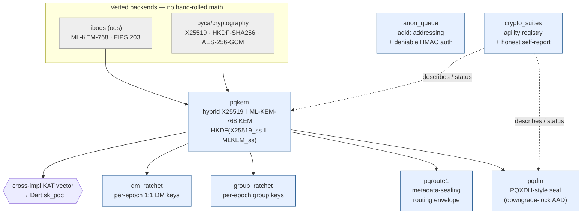

# sk-pqc (Python)

> ⚠️ **Experimental · pre-1.0 · NOT independently security-audited.** This is a clean-room
> **reference implementation** — tested and cross-impl-parity-verified against our Rust
> (`sk-pqc`) and Dart (`sk_pqc`) builds, but it has had **no third-party security audit,
> fuzzing, or formal review**. Primitives bind vetted libraries (`liboqs`/ML-KEM,
> `cryptography`); the original code is the wiring. **Review it yourself before production
> use.** We apply our own honest-claims discipline to the library itself: don't trust it
> beyond the evidence.

**`sk-pqc` is a small, app-agnostic Python library of vetted *hybrid post-quantum* cryptographic primitives.**
**Use it to add hybrid X25519 + ML-KEM-768 (FIPS 203) confidentiality to any app — without dragging in a messaging framework.**

It is the Python sibling of the public Dart [`sk_pqc`](https://github.com/smilinTux/sk-pqc-dart) package and is **byte-for-byte interoperable** with it (shared cross-impl KAT vector). Import name `sk_pqc`; PyPI name `sk-pqc`.

- **Maturity tier:** T2 — Hybrid KEM (key exchange/wrap is `HKDF(X25519 ‖ ML-KEM-768)`; signatures stay classical/optional-hybrid). Per [sk-standards CRYPTOGRAPHY_STANDARD](https://github.com/smilinTux/sk-standards).
- **License:** Apache-2.0 · **Python:** ≥ 3.10 · **Version:** 0.1.0

> **Honest claim.** "Hybrid" means a derived secret is confidential if **EITHER** the classical X25519 leg **OR** the ML-KEM-768 leg holds — it survives a future cryptographically-relevant quantum computer breaking X25519, and it survives a classical break of ML-KEM. It is **not** "quantum-proof", "quantum-safe", or "unbreakable". AES-256-GCM (the bulk cipher) is symmetric / Grover-only and already quantum-acceptable. Citations: **FIPS 203** (ML-KEM), **FIPS 204** (ML-DSA, registry only), RFC 7748 (X25519), RFC 5869 (HKDF), SP 800-38D (AES-GCM).

---

## What's in the box

| Module | Primitive | What it gives you |
|---|---|---|
| `sk_pqc.pqkem` | **Hybrid KEM** `x25519-mlkem768` | `hybrid_keypair / hybrid_encap / hybrid_decap`. ML-KEM-768 leg = liboqs (`oqs`), X25519 leg + HKDF combiner = pyca `cryptography`. The combiner is the only original crypto: `HKDF-SHA256(X25519_ss ‖ MLKEM768_ss)` — **concat-then-KDF, never XOR, never pure-PQ**. |
| `sk_pqc.pqdm` | **PQXDH-style seal** | `seal / open_sealed` a body to a recipient's published hybrid prekey (`PrekeyBundle`), AES-256-GCM under a KEM-derived key, with a **downgrade-lock AAD** that makes silent classical downgrade detectable. |
| `sk_pqc.pqroute` | **Metadata-sealing routing envelope** `pqroute1` | `seal_routed / open_routed / read_route_header`. Splits a plaintext next-hop header (a relay reads it, but it is AEAD-bound / tamper-evident) from a hybrid-sealed inner (final destination + content) a relay cannot read. |
| `sk_pqc.group_ratchet` | **Group epoch ratchet** | Per-epoch secret distributed once via the hybrid KEM; per-message keys derived symmetrically + index-addressable (loss/reorder tolerant). Forward secrecy across epochs, post-compromise security from independent epoch secrets. |
| `sk_pqc.dm_ratchet` | **1:1 DM epoch ratchet** | The pairwise analogue of the group ratchet (distinct HKDF domain labels — a DM key can never collide with a group key). |
| `sk_pqc.anon_queue` | **Anon-queue addressing + deniable auth** | `new_queue_pair` (uncorrelated recipient/sender ids), the `aqid:` address codec, and a repudiable `HMAC-SHA256` authenticator. Addressing + deniable-auth **only** — not a transport. |
| `sk_pqc.crypto_suites` | **Crypto-agility registry** | Machine-readable suite-ids → primitives + quantum-resistance status + FIPS refs. The honest predicate `is_quantum_resistant(suite_id)` no caller should hand-roll. |

**Never silently downgrades.** If the liboqs backend is missing, hybrid operations raise `PqKemUnavailable` (a hard error). The pure-pyca pieces — combiner KAT, suite registry, anon-queue codec/MAC, key derivation — work with no PQ backend at all.

---

## Architecture



---

## Install

```bash
# Core (pure-pyca pieces work; hybrid KEM needs the pq extra)
pip install sk-pqc

# With the post-quantum (ML-KEM-768) leg via liboqs
pip install "sk-pqc[pq]"
```

> The ML-KEM leg uses [`liboqs-python`](https://github.com/open-quantum-safe/liboqs-python) (import name `oqs`), which binds the native liboqs. Point `oqs` at a prebuilt `liboqs.so` with `OQS_INSTALL_PATH` (or `SK_PQC_LIBOQS`) to avoid a source build — `sk_pqc.pqkem.ensure_liboqs_path()` applies this best-effort on import.

## Quickstart

```python
from sk_pqc import hybrid_keypair, hybrid_encap, hybrid_decap

kp = hybrid_keypair()                       # 1216 B pub, 2432 B priv
ct, ss_sender = hybrid_encap(kp.public_key) # 1120 B ciphertext + 32 B secret
ss_recipient  = hybrid_decap(ct, kp.private_key)
assert ss_sender == ss_recipient            # secure if EITHER leg holds
```

```python
from sk_pqc import PrekeyBundle, seal, open_sealed, SUITE_ID

bundle = PrekeyBundle(suite=SUITE_ID, hybrid_public_hex=kp.public_key.hex())
blob = seal(b"top secret", bundle, sender="alice", recipient="bob")
assert open_sealed(blob, kp.private_key, sender="alice", recipient="bob") == b"top secret"
```

## Test

```bash
# From a checkout (run from HOME to avoid local-namespace collisions)
cd ~ && python -m pytest /path/to/sk-pqc-py/tests -q
```

The cross-implementation interop gate (`test_pqkem.py::test_cross_impl_vector_matches_sk_pqc`) decapsulates the shared Dart/Python KAT vector and asserts the recorded shared secret — this is what proves the two implementations agree byte-for-byte. PQ tests skip cleanly if liboqs is unavailable; the pure-pyca combiner KAT + registry tests always run.

## Self-report (claim evidence)

```python
from sk_pqc import get_suite, is_quantum_resistant
s = get_suite("x25519-mlkem768")
print(s.status.value, s.fips_refs, is_quantum_resistant("x25519-mlkem768"))
# hybrid-pq ('FIPS 203', 'RFC 7748', 'RFC 5869') True
```

## Provenance / clean-room

The `pqroute1` routing split and the `anon_queue` addressing are inspired by the *shape* of mix/relay designs (incl. SimpleX, AGPL-3.0) — **clean-room: no third-party code was copied or translated**, only the protocol idea. The wire formats, codecs, and MAC constructions are original and built solely on the vetted backends above.

## Related projects / See also

- ↔️ **Sibling:** [sk_pqc](https://github.com/smilinTux/sk-pqc-dart) — the Dart hybrid-KEM companion this package interoperates with (shared KAT vector).
- ⬇️ **Used by:** [skcomms](https://github.com/smilinTux/skcomms) — sovereign multi-transport comms (envelope payload + routing seal).
- ⬇️ **Used by:** [skchat](https://github.com/smilinTux/skchat) — AI-native encrypted chat (group + 1:1 DM ratchets).
- ↔️ **Sibling:** [sk_pgp](https://github.com/smilinTux/sk_pgp) — sovereign OpenPGP-PQC signing library (the signature counterpart).
- 📐 **Standards:** [sk-standards](https://github.com/smilinTux/sk-standards) — crypto, data-flow, version, and doc/SOP standards this repo conforms to.
