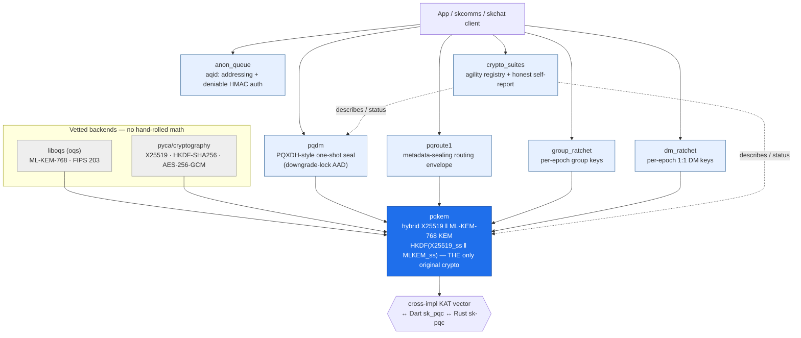
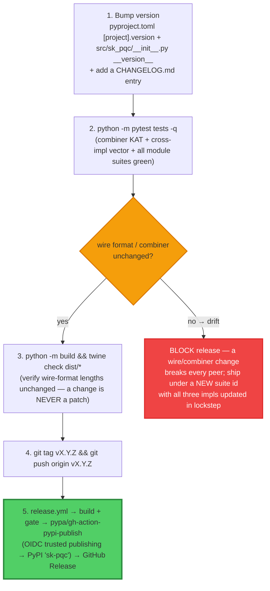

# sk-pqc (Python) — Standard Operating Procedures

`sk-pqc` is a sovereign, **app-agnostic** Python library of vetted **hybrid
post-quantum** cryptographic primitives. Its centre is one suite —
**`x25519-mlkem768`** (X25519 + ML-KEM-768, FIPS 203) — and a single original
cryptographic construction, the **HKDF-SHA256 hybrid combiner**. Everything above
the combiner (PQXDH-style seal, routing envelope, epoch ratchets, anon-queue
addressing, suite registry) is **wiring** over that KEM plus AES-256-GCM. The
lattice and curve math are **bound, never hand-rolled** (liboqs for ML-KEM-768 via
the `oqs` import; pyca `cryptography` for X25519 / HKDF / AES-256-GCM).

It is **byte-for-byte interoperable** with the Dart [`sk_pqc`](https://pub.dev/packages/sk_pqc)
and Rust [`sk-pqc`](https://crates.io/crates/sk-pqc) siblings — a blob sealed by any
one opens in the other two; the deterministic constructions are pinned by a shared
cross-impl KAT vector (`tests/vectors/hybrid_kem_x25519_mlkem768.json`). All three
import as `sk_pqc`.

**Maturity tier:** **T2 — Hybrid KEM** (per the sk-standards
[CRYPTOGRAPHY_STANDARD](https://github.com/smilinTux/sk-standards)). Key exchange /
wrap uses `HKDF(X25519 ‖ ML-KEM-768)`, which neutralises Harvest-Now-Decrypt-Later
on anything wrapped through it. It is **KEM-only and honest about it** — signatures
(ML-DSA / SLH-DSA, T3) are out of scope / future work; this library authenticates
**nothing** by itself (pair it with `sk_pgp` or a hybrid-signature layer).

## Honest-claim posture (non-negotiable)

- This is **quantum-resistant** / **post-quantum**. It is **never** "quantum-proof,"
  "quantum-safe," or "unbreakable."
- **Hybrid** means the derived secret is secure if **EITHER** the classical X25519
  leg **OR** the ML-KEM-768 leg holds — we **combine**, never replace. Concat-then-KDF,
  **never XOR, never pure-PQ**.
- We target the **FIPS 203 ML-KEM-768** tier (the internet default, matching TLS
  `X25519MLKEM768` and Signal PQXDH). It is **not** the CNSA-2.0 ceiling (ML-KEM-1024).
- AES-256-GCM (the bulk cipher) is symmetric / Grover-only and already
  quantum-acceptable.
- Every external claim cites **surface + FIPS number + hybrid-vs-classical**.
- ⚠️ **Experimental · pre-1.0 · NOT independently security-audited** — no third-party
  audit, fuzzing, or formal review. Review it yourself before production use.

**Standards anchored:** FIPS 203 (ML-KEM), FIPS 204/205 (ML-DSA/SLH-DSA — future
work, cited for scope), RFC 5869 (HKDF), RFC 7748 (X25519), RFC 9180 (HPKE / DHKEM
shape of the X25519 leg), SP 800-38D (AES-GCM), NIST CSWP 39 (crypto-agility).
**License:** Apache-2.0 · **Python:** ≥ 3.10.

---

## Architecture

### 1. Module dependency graph

Everything funnels through `pqkem` (the only asymmetric/PQ surface). The pure-pyca
pieces — combiner KAT, suite registry, anon-queue codec/MAC, ratchet key
derivation — work with **no PQ backend at all**; the hybrid operations raise
`PqKemUnavailable` (a hard error) when liboqs is missing, **never** a silent
classical downgrade.



| Module | Source | Primitive | Bound library | Hand-rolled? |
|---|---|---|---|---|
| `pqkem` | `src/sk_pqc/pqkem.py` | hybrid KEM `x25519-mlkem768` | liboqs + pyca | **combiner only** |
| `pqdm` | `src/sk_pqc/pqdm.py` | PQXDH-style seal + downgrade-lock AAD | pyca AES-256-GCM/HKDF | no (wiring) |
| `pqroute` | `src/sk_pqc/pqroute.py` | `pqroute1` metadata-sealing envelope | pyca AES-256-GCM/HKDF | no (wiring) |
| `group_ratchet` | `src/sk_pqc/group_ratchet.py` | per-epoch group key schedule | pyca HKDF/AES-256-GCM | no (wiring) |
| `dm_ratchet` | `src/sk_pqc/dm_ratchet.py` | per-epoch 1:1 DM key schedule | pyca HKDF/AES-256-GCM | no (wiring) |
| `anon_queue` | `src/sk_pqc/anon_queue.py` | `aqid:` addressing + deniable HMAC | pyca HMAC-SHA256 | no (wiring) |
| `crypto_suites` | `src/sk_pqc/crypto_suites.py` | agility registry + honest self-report | — | no (data) |

### 2. The hybrid combiner — encap / decap flow

Both legs run independently; their shared secrets are **concatenated (X25519
first), then fed through HKDF-SHA256** to produce the 32-byte hybrid secret. The
X25519 leg is an **ephemeral-static DHKEM** (HPKE/TLS style): the encapsulator ships
a fresh ephemeral public key as its 32-byte "ciphertext." The ML-KEM-768 leg is
exactly FIPS 203 and uses **implicit rejection** — a tampered ciphertext does
**not** throw; it yields a pseudo-random secret that simply won't match.

```mermaid
sequenceDiagram
    autonumber
    participant E as Encapsulator
    participant K as pqkem (suite x25519-mlkem768)
    participant D as Decapsulator (holds private key)

    Note over D: hybrid_keypair()
    D->>D: X25519 static keypair (seed 32B)
    D->>D: ML-KEM-768 keypair (pk 1184B / sk 2400B)
    D-->>E: public_key = X25519_pub(32) ‖ MLKEM_pub(1184) = 1216B

    Note over E: hybrid_encap(public_key)
    E->>E: split public_key → X25519_pub, MLKEM_pub
    E->>E: X25519 leg: fresh ephemeral kp; ss_x = DH(eph_priv, X25519_pub)
    E->>E: ML-KEM leg: (ct_m, ss_m) = ML-KEM.Encaps(MLKEM_pub)  [liboqs]
    E->>K: _combine(ss_x ‖ ss_m, info)
    K-->>E: ss = HKDF-SHA256(IKM=ss_x‖ss_m, salt=b"", info=b"sk_pqc/x25519-mlkem768/v1", L=32)
    E-->>D: ciphertext = eph_pub(32) ‖ ct_m(1088) = 1120B
    Note over E: use ss as AES-256-GCM key (32B)

    Note over D: hybrid_decap(ciphertext, private_key)
    D->>D: split ciphertext → eph_pub, ct_m
    D->>D: X25519 leg: ss_x = DH(X25519_priv, eph_pub)
    D->>D: ML-KEM leg: ss_m = ML-KEM.Decaps(ct_m, MLKEM_sk)  [implicit rejection]
    D->>K: _combine(ss_x ‖ ss_m, info)
    K-->>D: ss' = HKDF-SHA256(...)
    Note over D: ss' == ss ⇔ both legs matched
```

**The combiner — the one rule that must never deviate:**

```
shared_secret = HKDF-SHA256( IKM  = X25519_ss ‖ MLKEM768_ss,   # X25519 part FIRST
                             salt = b""  (RFC 5869 → HashLen zero bytes),
                             info = b"sk_pqc/x25519-mlkem768/v1" | <context label>,
                             L    = 32 )
```

`‖` is byte concatenation, **X25519 first. Concatenate-then-KDF. Never XOR. Never
pure-PQ.** Pass a context label as `info` for domain separation. For the per-module
data-flow (pqdm downgrade-lock, pqroute split, ratchet key schedule) see
[docs/ARCHITECTURE.md](docs/ARCHITECTURE.md).

**Wire format — the interop contract (lengths are FIXED, MUST NOT change):**

| Element | Layout | Bytes | Constant |
|---|---|---|---|
| public key | `X25519_pub(32)` ‖ `MLKEM768_pub(1184)` | **1216** | `PUBLIC_KEY_LEN` |
| private key | `X25519_priv_seed(32)` ‖ `MLKEM768_secret(2400)` | **2432** | `PRIVATE_KEY_LEN` |
| ciphertext | `X25519_ephemeral_pub(32)` ‖ `MLKEM768_ct(1088)` | **1120** | `CIPHERTEXT_LEN` |
| shared secret | `HKDF-SHA256(...)` | **32** | — |

### 3. HKDF domain-separation labels

Each layer keys HKDF with a distinct `info` label so a key from one layer can
**never** collide with another (DM keys can never equal group keys, etc.):

| Layer | `info` label |
|---|---|
| hybrid combiner | `sk_pqc/x25519-mlkem768/v1` |
| `pqdm` wrap | `skcomms/pqdm/wrap/v1 \| <downgrade-lock AAD>` |
| `pqroute` inner wrap | `skcomms/pqroute/wrap/v1 \| <route-header AAD>` |
| `group_ratchet` epoch-wrap | `skchat/group-ratchet/epoch-wrap/v1` |
| `group_ratchet` message key | `skchat/group-ratchet/msg/v1/<index>` (salt `skchat/epoch/<epoch>`) |
| `dm_ratchet` epoch-wrap | `skchat/dm-ratchet/epoch-wrap/v1` |
| `dm_ratchet` message key | `skchat/dm-ratchet/msg/v1/<index>` (salt `skchat/dm-epoch/<epoch>`) |

---

## Build

`sk-pqc` is a **published PyPI package**, not a deployed service. "Build" = produce
the sdist + wheel; the only runtime native dependency is liboqs (for the PQ leg).

```bash
python -m pip install --upgrade build
python -m build            # → dist/sk_pqc-<ver>-py3-none-any.whl + .tar.gz
python -m pip install twine && twine check dist/*
```

### The ML-KEM-768 native leg (liboqs)

The PQ leg uses [`liboqs-python`](https://github.com/open-quantum-safe/liboqs-python)
(import name `oqs`), which binds native liboqs. To avoid a source build, point `oqs`
at a prebuilt shared library:

```bash
# Build liboqs once (proven on Linux desktop with liboqs 0.14.0):
git clone --branch 0.14.0 https://github.com/open-quantum-safe/liboqs
cmake -GNinja -DBUILD_SHARED_LIBS=ON -DOQS_BUILD_ONLY_LIB=ON \
      -DCMAKE_INSTALL_PREFIX=$HOME/.local -S liboqs -B liboqs/build
ninja -C liboqs/build install

export OQS_INSTALL_PATH=$HOME/.local        # or: export SK_PQC_LIBOQS=$HOME/.local/lib/liboqs.so
```

`sk_pqc.pqkem.ensure_liboqs_path()` applies this best-effort on import (reads
`OQS_INSTALL_PATH` / `SK_PQC_LIBOQS`). Without liboqs the pure-pyca pieces still work;
hybrid KEM operations raise `PqKemUnavailable`.

---

## Test

```bash
# Run from $HOME to avoid local-namespace collisions with the src/ layout.
cd ~ && python -m pytest /path/to/sk-pqc-py/tests -q
```

| Suite | File | Covers |
|---|---|---|
| Hybrid KEM | `tests/test_pqkem.py` | round-trips, fixed wire lengths, **cross-impl vector** (`test_cross_impl_vector_matches_sk_pqc`), `PqKemUnavailable` on missing backend |
| PQXDH seal | `tests/test_pqdm.py` | seal/open round-trip, downgrade-lock AAD, `DowngradeDetected` on tamper |
| Routing envelope | `tests/test_pqroute.py` | header read by relay, inner sealed, tamper/rewrite rejection |
| Group ratchet | `tests/test_group_ratchet.py` | epoch wrap/unwrap, index-addressable message keys, loss/reorder tolerance |
| DM ratchet | `tests/test_dm_ratchet.py` | pairwise epochs, DM-vs-group label domain separation |
| Anon queue | `tests/test_anon_queue.py` | `aqid:` codec round-trip, deniable HMAC verify/reject |
| Suite registry | `tests/test_crypto_suites.py` | status resolution, honest `is_quantum_resistant` predicate |

The **cross-implementation interop gate**
(`test_pqkem.py::test_cross_impl_vector_matches_sk_pqc`) decapsulates the shared
Dart/Rust/Python KAT vector and asserts the recorded shared secret — this is what
proves the three implementations agree byte-for-byte. PQ tests skip cleanly if
liboqs is unavailable; the pure-pyca combiner KAT + registry tests always run.

---

## Release (to PyPI)

Publishing uses **PyPI Trusted Publishing (OIDC)** — no API token is stored
anywhere. The workflow `.github/workflows/release.yml` runs on a pushed `v*` tag:
it builds, re-runs the byte-identity gate as a guard, publishes to PyPI over OIDC,
then cuts the matching GitHub Release. Full details in [PUBLISHING.md](PUBLISHING.md).



**One-time setup (browser, maintainer):** register the trusted publisher at
<https://pypi.org/manage/account/publishing/> — PyPI project `sk-pqc`, owner
`smilinTux`, repo `sk-pqc-py`, workflow `release.yml`, environment `pypi`. After
that, pushing a `v*` tag triggers the upload; `workflow_dispatch` allows a build +
gate dry-run with no publish.

A wire-format or combiner change is **never** a patch release — it ships under a new
suite id with the Dart and Rust verifiers updated in lockstep. See
[CONTRIBUTING.md](CONTRIBUTING.md) and [SECURITY.md](SECURITY.md).

### Front-end / Exposure

Per [sk-standards `UNIFIED_INGRESS_STANDARD.md`](https://github.com/smilinTux/sk-standards/blob/main/standards/UNIFIED_INGRESS_STANDARD.md):
**N/A — no network surface (library).** `sk_pqc` is a published PyPI library; it has no
daemon, port, or listener and answers no public `:443` route.

---

## Config

| Knob | Where | Effect |
|---|---|---|
| `OQS_INSTALL_PATH` | env | liboqs install prefix (`oqs` finds `lib/liboqs.so` under it) |
| `SK_PQC_LIBOQS` | env | absolute path to the liboqs shared lib (highest-priority hint) |
| `LD_LIBRARY_PATH` | env | dynamic-loader search path for liboqs |
| `info` arg | `hybrid_encap` / `hybrid_decap` | HKDF domain-separation label (default `sk_pqc/x25519-mlkem768/v1`) |

---

## Troubleshooting

| Symptom | Likely cause | Fix |
|---|---|---|
| `PqKemUnavailable` on a hybrid call | liboqs / `oqs` not importable | `pip install "sk-pqc[pq]"`; set `OQS_INSTALL_PATH` or `SK_PQC_LIBOQS` to a prebuilt liboqs; check `LD_LIBRARY_PATH` |
| `ModuleNotFoundError: oqs` | `pq` extra not installed | install the `[pq]` extra (pulls `liboqs-python`) |
| PQ tests skip silently | no liboqs present | expected — pure-pyca tests still run; install liboqs 0.14.0 (see Build) to enable |
| `import sk_pqc` finds the local `src/` dir, not the package | running pytest from the repo root | run from `$HOME` (`cd ~ && pytest /path/to/sk-pqc-py/tests`) |
| `hybrid_decap` secret never matches | tampered/truncated ciphertext, or peer used a different `info` | ML-KEM implicit rejection is silent — confirm wire lengths (1120B ct) and identical `info` on both sides |
| `PqKemFormatError` / bad length | wrong-sized key/ct on the wire | verify 1216B pub / 2432B priv / 1120B ct — fixed and version-pinned |
| `DowngradeDetected` on `open_sealed` | negotiated suite mismatch (possible silent-downgrade / transcript tamper) | confirm both sides negotiated the same suite; this is the downgrade-lock *working* |
| cross-impl vector MISMATCH | combiner drift (XOR, wrong order, wrong info) | combiner MUST be `HKDF-SHA256(X25519_ss ‖ MLKEM_ss)`, X25519 first; re-run `tests/test_pqkem.py` |
| publish blocked: tests red | wire-format or combiner change | **do not publish** — divergence breaks every peer; revert or coordinate a suite-id bump across all three impls |

---

**SK = staycuriousANDkeepsmilin 🐧** — *sk-pqc: hybrid post-quantum primitives, honest about KEM-only.*
