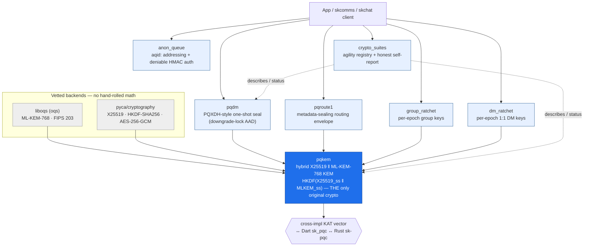
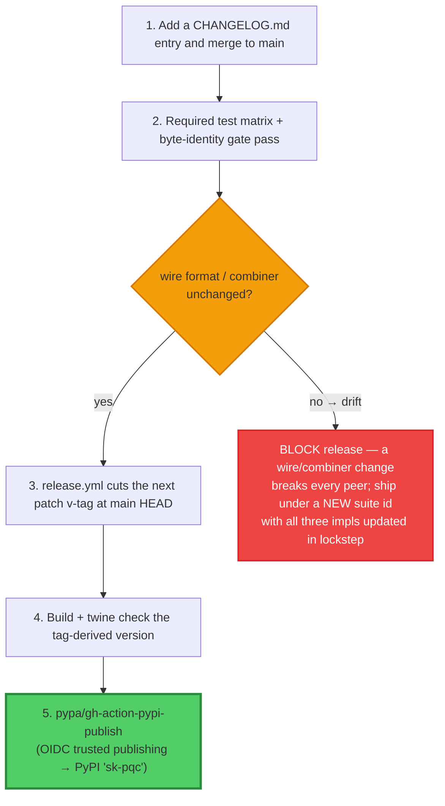

# sk-pqc (Python) — Standard Operating Procedures

`sk-pqc` is a sovereign, **app-agnostic** Python library of vetted **hybrid
post-quantum** cryptographic primitives. Its centre is one suite —
**`x25519-mlkem768`** (X25519 + ML-KEM-768, FIPS 203) — and a single original
cryptographic construction, the **HKDF-SHA256 hybrid combiner**. Everything above
the combiner (PQXDH-style seal, routing envelope, epoch ratchets, anon-queue
addressing, suite registry) is **wiring** over that KEM plus AES-256-GCM. The
lattice and curve math are **bound, never hand-rolled** (liboqs for ML-KEM-768 via
the `oqs` import; pyca `cryptography` for X25519 / HKDF / AES-256-GCM).

---

## 1. Overview

### Purpose and scope

`sk-pqc` gives a Python caller a **32-byte hybrid shared secret** and the sealed-blob
formats built on it. It owns the suite `x25519-mlkem768`, the combiner, the wire
formats, and the suite registry that backs the self-report (section 9).

It is **byte-for-byte interoperable** with the Dart [`sk_pqc`](https://pub.dev/packages/sk_pqc)
and Rust [`sk-pqc`](https://crates.io/crates/sk-pqc) siblings — a blob sealed by any
one opens in the other two; the deterministic constructions are pinned by a shared
cross-impl KAT vector (`tests/vectors/hybrid_kem_x25519_mlkem768.json`). All three
import as `sk_pqc`.

### What it explicitly does NOT do

- **It authenticates nothing.** This is a KEM. An unauthenticated KEM is trivially
  machine-in-the-middled: **authenticate the public keys out of band.** Pair it with
  `sk_pgp` or a hybrid-signature layer.
- **No signatures.** ML-DSA / SLH-DSA (T3) are out of scope and not planned here.
- **No transport, no key storage, no trust decisions.** Those belong to the caller.

### Maturity tier

**T2, Hybrid KEM** (per the sk-standards
[CRYPTOGRAPHY_STANDARD](https://github.com/smilinTux/sk-standards/blob/main/standards/CRYPTOGRAPHY_STANDARD.md)).
Key exchange / wrap uses `HKDF(X25519 || ML-KEM-768)`, which neutralises
Harvest-Now-Decrypt-Later on anything wrapped through it. It is **KEM-only and honest
about it**. Full per-axis detail and the version reference are in **section 9**.

### Honest-claim posture (non-negotiable)

- This is **quantum-resistant** / **post-quantum**. It is **never** "quantum-proof,"
  "quantum-safe," or "unbreakable."
- **Hybrid** means the derived secret is secure if **EITHER** the classical X25519
  leg **OR** the ML-KEM-768 leg holds — we **combine**, never replace. Concat-then-KDF,
  **never XOR, never pure-PQ**.
- We target the **FIPS 203 ML-KEM-768** tier (the internet default, matching TLS
  `X25519MLKEM768` and Signal PQXDH). It is **not** the CNSA-2.0 ceiling (ML-KEM-1024).
- AES-256-GCM (the bulk cipher) is symmetric / Grover-only and already
  quantum-acceptable.
- Every external claim cites **surface + FIPS number + hybrid-vs-classical**.
- ⚠️ **Experimental · pre-1.0 · NOT independently security-audited** — no third-party
  audit, fuzzing, or formal review. Review it yourself before production use.

**Standards anchored:** FIPS 203 (ML-KEM), FIPS 204/205 (ML-DSA/SLH-DSA — future
work, cited for scope), RFC 5869 (HKDF), RFC 7748 (X25519), RFC 9180 (HPKE / DHKEM
shape of the X25519 leg), SP 800-38D (AES-GCM), NIST CSWP 39 (crypto-agility).
**License:** Apache-2.0 · **Python:** ≥ 3.10.

---

## 2. Architecture

### 1. Module dependency graph

Everything funnels through `pqkem` (the only asymmetric/PQ surface). The pure-pyca
pieces — combiner KAT, suite registry, anon-queue codec/MAC, ratchet key
derivation — work with **no PQ backend at all**; the hybrid operations raise
`PqKemUnavailable` (a hard error) when liboqs is missing, **never** a silent
classical downgrade.


```mermaid
flowchart TD
    APP["App / skcomms / skchat client"]

    subgraph backends["Vetted backends — no hand-rolled math"]
        OQS["liboqs (oqs)<br/>ML-KEM-768 · FIPS 203"]
        PYCA["pyca/cryptography<br/>X25519 · HKDF-SHA256 · AES-256-GCM"]
    end

    KEM["pqkem<br/>hybrid X25519 ‖ ML-KEM-768 KEM<br/>HKDF(X25519_ss ‖ MLKEM_ss) — THE only original crypto"]

    OQS --> KEM
    PYCA --> KEM

    APP --> DM["pqdm<br/>PQXDH-style one-shot seal<br/>(downgrade-lock AAD)"]
    APP --> ROUTE["pqroute1<br/>metadata-sealing routing envelope"]
    APP --> GR["group_ratchet<br/>per-epoch group keys"]
    APP --> DMR["dm_ratchet<br/>per-epoch 1:1 DM keys"]
    APP --> AQ["anon_queue<br/>aqid: addressing + deniable HMAC auth"]
    APP --> REG["crypto_suites<br/>agility registry + honest self-report"]

    DM --> KEM
    ROUTE --> KEM
    GR --> KEM
    DMR --> KEM

    REG -. "describes / status" .-> KEM
    REG -. "describes / status" .-> DM

    KEM --> VEC{{"cross-impl KAT vector<br/>↔ Dart sk_pqc ↔ Rust sk-pqc"}}

    classDef prim fill:#e6f0ff,stroke:#369;
    classDef be fill:#eee,stroke:#999;
    classDef hub fill:#1f6feb,stroke:#0b3d91,color:#fff;
    class DM,ROUTE,GR,DMR,REG,AQ prim;
    class KEM hub;
    class OQS,PYCA be;
```

| Module | Source | Primitive | Bound library | Hand-rolled? |
|---|---|---|---|---|
| `pqkem` | `src/sk_pqc/pqkem.py` | hybrid KEM `x25519-mlkem768` | liboqs + pyca | **combiner only** |
| `pqdm` | `src/sk_pqc/pqdm.py` | PQXDH-style seal + downgrade-lock AAD | pyca AES-256-GCM/HKDF | no (wiring) |
| `pqroute` | `src/sk_pqc/pqroute.py` | `pqroute1` metadata-sealing envelope | pyca AES-256-GCM/HKDF | no (wiring) |
| `group_ratchet` | `src/sk_pqc/group_ratchet.py` | per-epoch group key schedule | pyca HKDF/AES-256-GCM | no (wiring) |
| `dm_ratchet` | `src/sk_pqc/dm_ratchet.py` | per-epoch 1:1 DM key schedule | pyca HKDF/AES-256-GCM | no (wiring) |
| `anon_queue` | `src/sk_pqc/anon_queue.py` | `aqid:` addressing + deniable HMAC | pyca HMAC-SHA256 | no (wiring) |
| `crypto_suites` | `src/sk_pqc/crypto_suites.py` | agility registry + honest self-report | — | no (data) |

### 2. The hybrid combiner — encap / decap flow

Both legs run independently; their shared secrets are **concatenated (X25519
first), then fed through HKDF-SHA256** to produce the 32-byte hybrid secret. The
X25519 leg is an **ephemeral-static DHKEM** (HPKE/TLS style): the encapsulator ships
a fresh ephemeral public key as its 32-byte "ciphertext." The ML-KEM-768 leg is
exactly FIPS 203 and uses **implicit rejection** — a tampered ciphertext does
**not** throw; it yields a pseudo-random secret that simply won't match.

```mermaid
sequenceDiagram
    autonumber
    participant E as Encapsulator
    participant K as pqkem (suite x25519-mlkem768)
    participant D as Decapsulator (holds private key)

    Note over D: hybrid_keypair()
    D->>D: X25519 static keypair (seed 32B)
    D->>D: ML-KEM-768 keypair (pk 1184B / sk 2400B)
    D-->>E: public_key = X25519_pub(32) ‖ MLKEM_pub(1184) = 1216B

    Note over E: hybrid_encap(public_key)
    E->>E: split public_key → X25519_pub, MLKEM_pub
    E->>E: X25519 leg: fresh ephemeral kp; ss_x = DH(eph_priv, X25519_pub)
    E->>E: ML-KEM leg: (ct_m, ss_m) = ML-KEM.Encaps(MLKEM_pub)  [liboqs]
    E->>K: _combine(ss_x ‖ ss_m, info)
    K-->>E: ss = HKDF-SHA256(IKM=ss_x‖ss_m, salt=b"", info=b"sk_pqc/x25519-mlkem768/v1", L=32)
    E-->>D: ciphertext = eph_pub(32) ‖ ct_m(1088) = 1120B
    Note over E: use ss as AES-256-GCM key (32B)

    Note over D: hybrid_decap(ciphertext, private_key)
    D->>D: split ciphertext → eph_pub, ct_m
    D->>D: X25519 leg: ss_x = DH(X25519_priv, eph_pub)
    D->>D: ML-KEM leg: ss_m = ML-KEM.Decaps(ct_m, MLKEM_sk)  [implicit rejection]
    D->>K: _combine(ss_x ‖ ss_m, info)
    K-->>D: ss' = HKDF-SHA256(...)
    Note over D: ss' == ss ⇔ both legs matched
```

**The combiner — the one rule that must never deviate:**

```
shared_secret = HKDF-SHA256( IKM  = X25519_ss ‖ MLKEM768_ss,   # X25519 part FIRST
                             salt = b""  (RFC 5869 → HashLen zero bytes),
                             info = b"sk_pqc/x25519-mlkem768/v1" | <context label>,
                             L    = 32 )
```

`‖` is byte concatenation, **X25519 first. Concatenate-then-KDF. Never XOR. Never
pure-PQ.** Pass a context label as `info` for domain separation. For the per-module
data-flow (pqdm downgrade-lock, pqroute split, ratchet key schedule) see
[docs/ARCHITECTURE.md](docs/ARCHITECTURE.md).

**Wire format — the interop contract (lengths are FIXED, MUST NOT change):**

| Element | Layout | Bytes | Constant |
|---|---|---|---|
| public key | `X25519_pub(32)` ‖ `MLKEM768_pub(1184)` | **1216** | `PUBLIC_KEY_LEN` |
| private key | `X25519_priv_seed(32)` ‖ `MLKEM768_secret(2400)` | **2432** | `PRIVATE_KEY_LEN` |
| ciphertext | `X25519_ephemeral_pub(32)` ‖ `MLKEM768_ct(1088)` | **1120** | `CIPHERTEXT_LEN` |
| shared secret | `HKDF-SHA256(...)` | **32** | — |

### 3. HKDF domain-separation labels

Each layer keys HKDF with a distinct `info` label so a key from one layer can
**never** collide with another (DM keys can never equal group keys, etc.):

| Layer | `info` label |
|---|---|
| hybrid combiner | `sk_pqc/x25519-mlkem768/v1` |
| `pqdm` wrap | `skcomms/pqdm/wrap/v1 \| <downgrade-lock AAD>` |
| `pqroute` inner wrap | `skcomms/pqroute/wrap/v1 \| <route-header AAD>` |
| `group_ratchet` epoch-wrap | `skchat/group-ratchet/epoch-wrap/v1` |
| `group_ratchet` message key | `skchat/group-ratchet/msg/v1/<index>` (salt `skchat/epoch/<epoch>`) |
| `dm_ratchet` epoch-wrap | `skchat/dm-ratchet/epoch-wrap/v1` |
| `dm_ratchet` message key | `skchat/dm-ratchet/msg/v1/<index>` (salt `skchat/dm-epoch/<epoch>`) |

---

## 3. Build

`sk-pqc` is a **published PyPI package**, not a deployed service. "Build" = produce
the sdist + wheel; the only runtime native dependency is liboqs (for the PQ leg).

```bash
python -m pip install --upgrade build
python -m build            # → dist/sk_pqc-<ver>-py3-none-any.whl + .tar.gz
python -m pip install twine && twine check dist/*
```

### The ML-KEM-768 native leg (liboqs)

The PQ leg uses [`liboqs-python`](https://github.com/open-quantum-safe/liboqs-python)
(import name `oqs`), which binds native liboqs. To avoid a source build, point `oqs`
at a prebuilt shared library:

```bash
# Build liboqs once (proven on Linux desktop with liboqs 0.14.0):
git clone --branch 0.14.0 https://github.com/open-quantum-safe/liboqs
cmake -GNinja -DBUILD_SHARED_LIBS=ON -DOQS_BUILD_ONLY_LIB=ON \
      -DCMAKE_INSTALL_PREFIX=$HOME/.local -S liboqs -B liboqs/build
ninja -C liboqs/build install

export OQS_INSTALL_PATH=$HOME/.local        # or: export SK_PQC_LIBOQS=$HOME/.local/lib/liboqs.so
```

`sk_pqc.pqkem.ensure_liboqs_path()` applies this best-effort on import (reads
`OQS_INSTALL_PATH` / `SK_PQC_LIBOQS`). Without liboqs the pure-pyca pieces still work;
hybrid KEM operations raise `PqKemUnavailable`.

---

## 4. Test

```bash
# Run from $HOME to avoid local-namespace collisions with the src/ layout.
cd ~ && python -m pytest /path/to/sk-pqc-py/tests -q
```

| Suite | File | Covers |
|---|---|---|
| Hybrid KEM | `tests/test_pqkem.py` | round-trips, fixed wire lengths, **cross-impl vector** (`test_cross_impl_vector_matches_sk_pqc`), `PqKemUnavailable` on missing backend |
| PQXDH seal | `tests/test_pqdm.py` | seal/open round-trip, downgrade-lock AAD, `DowngradeDetected` on tamper |
| Routing envelope | `tests/test_pqroute.py` | header read by relay, inner sealed, tamper/rewrite rejection |
| Group ratchet | `tests/test_group_ratchet.py` | epoch wrap/unwrap, index-addressable message keys, loss/reorder tolerance |
| DM ratchet | `tests/test_dm_ratchet.py` | pairwise epochs, DM-vs-group label domain separation |
| Anon queue | `tests/test_anon_queue.py` | `aqid:` codec round-trip, deniable HMAC verify/reject |
| Suite registry | `tests/test_crypto_suites.py` | status resolution, honest `is_quantum_resistant` predicate |

The **cross-implementation interop gate**
(`test_pqkem.py::test_cross_impl_vector_matches_sk_pqc`) decapsulates the shared
Dart/Rust/Python KAT vector and asserts the recorded shared secret — this is what
proves the three implementations agree byte-for-byte. PQ tests skip cleanly if
liboqs is unavailable; the pure-pyca combiner KAT + registry tests always run.

---

## 5. Release (to PyPI)

Publishing uses **PyPI Trusted Publishing (OIDC)** — no API token is stored
anywhere. A push to `main` makes `.github/workflows/release.yml` cut the next patch
tag and build and publish that exact version in the same run. A manually pushed
`v*` tag is also accepted when it points to `main`. Full details are in
[PUBLISHING.md](PUBLISHING.md).


```mermaid
flowchart TD
    CHANGE["1. Add a CHANGELOG.md entry and merge to main"]
    TEST["2. Required test matrix + byte-identity gate pass"]
    TAG["3. release.yml cuts the next patch v-tag at main HEAD"]
    BUILD["4. Build + twine check the tag-derived version"]
    OIDC["5. pypa/gh-action-pypi-publish<br/>(OIDC trusted publishing → PyPI 'sk-pqc')"]

    GATE{"wire format / combiner<br/>unchanged?"}

    CHANGE --> TEST --> GATE
    GATE -->|"yes"| TAG --> BUILD --> OIDC
    GATE -->|"no → drift"| STOP["BLOCK release — a wire/combiner change<br/>breaks every peer; ship under a NEW suite id<br/>with all three impls updated in lockstep"]

    style OIDC fill:#51cf66,stroke:#2b8a3e,stroke-width:3px
    style GATE fill:#f59e0b,stroke:#d97706,stroke-width:2px
    style STOP fill:#ef4444,stroke:#dc2626,stroke-width:2px,color:#fff
```

**One-time setup (browser, maintainer):** register the trusted publisher at
<https://pypi.org/manage/account/publishing/> — PyPI project `sk-pqc`, owner
`smilinTux`, repo `sk-pqc-py`, workflow `release.yml`, environment `pypi`. After
that, merging to `main` cuts and publishes the next patch. A manual `v*` tag remains
supported, but the workflow rejects off-main tags unless the explicit emergency
override repository variable is set.

A wire-format or combiner change is **never** a patch release — it ships under a new
suite id with the Dart and Rust verifiers updated in lockstep. See
[CONTRIBUTING.md](CONTRIBUTING.md) and [SECURITY.md](SECURITY.md).

### Front-end / Exposure

Per [sk-standards `UNIFIED_INGRESS_STANDARD.md`](https://github.com/smilinTux/sk-standards/blob/main/standards/UNIFIED_INGRESS_STANDARD.md):
**N/A — no network surface (library).** `sk_pqc` is a published PyPI library; it has no
daemon, port, or listener and answers no public `:443` route.

---

## 6. Configuration / Usage

| Knob | Where | Effect |
|---|---|---|
| `OQS_INSTALL_PATH` | env | liboqs install prefix (`oqs` finds `lib/liboqs.so` under it) |
| `SK_PQC_LIBOQS` | env | absolute path to the liboqs shared lib (highest-priority hint) |
| `LD_LIBRARY_PATH` | env | dynamic-loader search path for liboqs |
| `info` arg | `hybrid_encap` / `hybrid_decap` | HKDF domain-separation label (default `sk_pqc/x25519-mlkem768/v1`) |

---

## 7. API / Reference

The full generated reference is `docs/api/` (pdoc HTML, also linked from the README).
This section is the **stable contract**: the names below are what consumers import and
what the cross-impl vector pins.

> ⚠️ **`docs/api/` is generated HTML committed to the repo.** It is a snapshot, not a
> build product regenerated on push, so it **will rot silently** as docstrings change.
> Treat this section and the docstrings in `src/` as authoritative, and regenerate
> `docs/api/` when you change the public surface. Nothing currently fails if it drifts.

### Interop constants (`sk_pqc.pqkem`, DO NOT CHANGE)

These are pinned by the cross-impl KAT vector. Changing any of them breaks the Dart
and Rust siblings silently, with no exception raised.

| Constant | Value | Meaning |
|---|---|---|
| `SUITE_ID` | `"x25519-mlkem768"` | the suite identifier on the wire |
| `MLKEM_ALG` | `"ML-KEM-768"` | the liboqs algorithm name |
| `HKDF_SALT` | `b""` | RFC 5869 empty salt (HashLen zero bytes) |
| `HKDF_INFO` | `b"sk_pqc/x25519-mlkem768/v1"` | default domain-separation label |
| `SHARED_SECRET_LEN` | `32` | HKDF output length |
| `X25519_PUB_LEN` / `X25519_SEED_LEN` | `32` / `32` | classical leg |
| `MLKEM_PUB_LEN` / `MLKEM_SECRET_LEN` / `MLKEM_CT_LEN` | `1184` / `2400` / `1088` | lattice leg |

Composite wire sizes follow from those: public `1216`, private `2432`, ciphertext
`1120`, shared secret `32`.

### Core KEM (`sk_pqc.pqkem`)

| Symbol | Shape | Notes |
|---|---|---|
| `hybrid_keypair()` | `-> (public, private)` | `1216` / `2432` bytes |
| `hybrid_encap(public_key, info=HKDF_INFO)` | `-> (ciphertext, shared_secret)` | `1120` / `32` bytes |
| `hybrid_decap(ciphertext, private_key, info=HKDF_INFO)` | `-> shared_secret` | `32` bytes; matches the encapsulator **iff both legs agree** |
| `PqKemUnavailable` | exception | raised when liboqs is missing. **A hard error, never a silent classical downgrade.** |
| `PqKemFormatError` | exception | malformed or wrong-length input |

### Suite registry and self-report (`sk_pqc.crypto_suites`)

This is the evidence surface. It is **pure stdlib** and needs no PQ backend, so it
answers even on a machine with no liboqs.

| Symbol | Returns |
|---|---|
| `get_suite(suite_id)` | a frozen suite record with `.status` and `.fips_refs` |
| `is_quantum_resistant(suite_id)` | `bool` |

```python
from sk_pqc import get_suite, is_quantum_resistant
s = get_suite("x25519-mlkem768")
print(s.status.value, s.fips_refs, is_quantum_resistant("x25519-mlkem768"))
# hybrid-pq ('FIPS 203', 'RFC 7748', 'RFC 5869') True
```

**That output is machine-checked.** The `docs-evidence` block at the end of this file
executes this exact call and asserts the exact values, so the claim cannot drift away
from the code without the gate going red. See section 9.

### Sealed formats

| Module | Entry points | Raises |
|---|---|---|
| `pqdm` | PQXDH-style one-shot seal / open with a downgrade-lock AAD | `DowngradeDetected` when the AEAD open fails (tamper or suite mismatch), `PqDmFormatError` |
| `pqroute` | `pqroute1` metadata-sealing routing envelope | `PqRouteFormatError` |
| `group_ratchet` / `dm_ratchet` | per-epoch group / 1:1 DM key schedules | format errors per module |
| `anon_queue` | `aqid:` addressing + deniable HMAC auth | `AnonQueueFormatError` |

`DowngradeDetected` (`src/sk_pqc/pqdm.py`) is the runtime tell that a negotiated suite
did not match. **A silent classical downgrade that does not surface as
`DowngradeDetected` is a security bug**, and SECURITY.md asks for it by name.

---

## 8. Troubleshooting

| Symptom | Likely cause | Fix |
|---|---|---|
| `PqKemUnavailable` on a hybrid call | liboqs / `oqs` not importable | `pip install "sk-pqc[pq]"`; set `OQS_INSTALL_PATH` or `SK_PQC_LIBOQS` to a prebuilt liboqs; check `LD_LIBRARY_PATH` |
| `ModuleNotFoundError: oqs` | `pq` extra not installed | install the `[pq]` extra (pulls `liboqs-python`) |
| PQ tests skip silently | no liboqs present | expected — pure-pyca tests still run; install liboqs 0.14.0 (see Build) to enable |
| `import sk_pqc` finds the local `src/` dir, not the package | running pytest from the repo root | run from `$HOME` (`cd ~ && pytest /path/to/sk-pqc-py/tests`) |
| `hybrid_decap` secret never matches | tampered/truncated ciphertext, or peer used a different `info` | ML-KEM implicit rejection is silent — confirm wire lengths (1120B ct) and identical `info` on both sides |
| `PqKemFormatError` / bad length | wrong-sized key/ct on the wire | verify 1216B pub / 2432B priv / 1120B ct — fixed and version-pinned |
| `DowngradeDetected` on `open_sealed` | negotiated suite mismatch (possible silent-downgrade / transcript tamper) | confirm both sides negotiated the same suite; this is the downgrade-lock *working* |
| cross-impl vector MISMATCH | combiner drift (XOR, wrong order, wrong info) | combiner MUST be `HKDF-SHA256(X25519_ss ‖ MLKEM_ss)`, X25519 first; re-run `tests/test_pqkem.py` |
| publish blocked: tests red | wire-format or combiner change | **do not publish** — divergence breaks every peer; revert or coordinate a suite-id bump across all three impls |

---

## 9. Maturity-tier + Version reference

### Maturity tier: **T2**

Scale: [sk-standards `standards/CRYPTOGRAPHY_STANDARD.md`](https://github.com/smilinTux/sk-standards/blob/main/standards/CRYPTOGRAPHY_STANDARD.md).
This is the T0-T4 **maturity** scale. It is **not** the FIPS 203 parameter set
(ML-KEM-768 vs ML-KEM-1024) referred to in section 1; the two are different scales.

| Tier | Meaning | `sk-pqc` status | Evidence |
|---|---|---|---|
| **T0, Classical** | asymmetric crypto is classical | superseded for KEM | `crypto_suites` records the classical suites as such |
| **T1, Agile** | suite ids + registry + backend abstraction + **self-report** | **met.** A real suite registry (`crypto_suites`) and a **runnable self-report** returning status and FIPS refs. | `get_suite(...).status` / `.fips_refs`, executed by the docs-evidence block below |
| **T2, Hybrid KEM** | key exchange uses `HKDF(X25519 \|\| MLKEM768)`; HNDL neutralised | **met. This is `sk-pqc`'s tier.** | `SUITE_ID`, `HKDF_INFO`, the IKM ordering, all pinned below; cross-impl KAT vector |
| **T3, Hybrid sig** | signatures use ML-DSA-65 + Ed25519 (additive) | **not met, out of scope.** This library signs nothing. | (nothing to measure) |
| **T4, Transport closed** | edge-to-origin TLS hybrid | **N/A**, a library with no transport leg | (nothing to measure) |

### The self-report is real, and it is checked

Unlike a suite id sitting in a constant, `sk-pqc` exposes a **runnable** self-report
that answers with the suite's status and the standards it cites:

```python
from sk_pqc import get_suite, is_quantum_resistant
s = get_suite("x25519-mlkem768")
print(s.status.value, s.fips_refs, is_quantum_resistant("x25519-mlkem768"))
# hybrid-pq ('FIPS 203', 'RFC 7748', 'RFC 5869') True
```

Two properties make this evidence rather than assertion:

1. **It runs with no PQ backend.** `crypto_suites` is pure stdlib, so the report
   answers even where liboqs is absent and the hybrid operations would raise.
2. **The docs-evidence block executes it** and asserts each field. If someone flips the
   suite status or drops a FIPS reference, the gate goes red. That check was negative
   tested by doing exactly those two things.

There is also a **runtime** downgrade tell: `DowngradeDetected` (section 7). A missing
PQ backend raises `PqKemUnavailable` rather than falling back to classical, so a
downgrade is an error, never a silent success.

### Version reference

The version has one source of truth: the repository's release `v*` tag.

| Where | Field |
|---|---|
| `pyproject.toml` | `[project] dynamic = ["version"]`; Hatch VCS reads the tag |
| `src/sk_pqc/__init__.py` | `__version__` reads installed distribution metadata |

There is no manually synchronized version copy. `hatch-vcs` derives artifact metadata
from the tag, while `importlib.metadata.version("sk-pqc")` reports that same installed
metadata at runtime. **The docs-evidence block asserts this wiring remains present.**

Do not quote a version number from this document. Inspect the installed distribution,
the latest release tag, or
<https://pypi.org/project/sk-pqc/> for what is actually published. Release mechanics
are in section 5; the wire format is frozen across `0.x` and any break ships under a
**new suite id** with the Dart and Rust siblings updated in lockstep.

---

## Unverified / needs an operator pass

Stated in this SOP but **not** re-executed while it was written:

- **The test suite was not run.** Section 4's description was read from `tests/`, not
  executed; the PQ paths need liboqs. CI is the authority for "the tests pass today".
  What *was* executed here is the self-report in section 7, whose exact output is
  asserted by the evidence block.
- **The cross-impl KAT parity claim** (a blob sealed by any one of Python/Dart/Rust
  opens in the other two) was **not** re-proven across all three implementations. What
  is verified here is that the shared vector file exists and that this repo's
  constants and IKM ordering still match what the docs describe.
- **The PyPI release flow** in section 5 was read from `.github/workflows/release.yml`,
  not exercised. `sk-pqc 0.1.0` is present on PyPI.
- **`docs/api/` generated HTML is committed and nothing regenerates or validates it.**
  It will drift from the docstrings silently. Flagged in section 7; fixing it (drop it
  from VCS and publish from CI, or add a regeneration check) is a follow-up.
- **Benchmarks** in the README were not re-run.

---

**SK = staycuriousANDkeepsmilin** *sk-pqc: hybrid post-quantum primitives, honest about KEM-only.*

<!-- docs-evidence
verified: 2026-08-15
checks:
  - name: the documented self-report RUNS and returns the documented values (SOP 7, 9)
    run: python3 -c 'import importlib.util,sys; sp=importlib.util.spec_from_file_location("_cs","src/sk_pqc/crypto_suites.py"); m=importlib.util.module_from_spec(sp); sys.modules["_cs"]=m; sp.loader.exec_module(m); s=m.get_suite("x25519-mlkem768"); assert s.status.value=="hybrid-pq", s.status; assert s.fips_refs==("FIPS 203","RFC 7748","RFC 5869"), s.fips_refs; assert m.is_quantum_resistant("x25519-mlkem768") is True'
  - name: package version is VCS-derived with no hard-coded runtime copy (SOP 9)
    run: grep -q '^dynamic = \["version"\]$' pyproject.toml && grep -q '^source = "vcs"$' pyproject.toml && grep -q 'version("sk-pqc")' src/sk_pqc/__init__.py && ! grep -qE '^__version__ = "[0-9]+\.[0-9]+' src/sk_pqc/__init__.py
  - name: suite id and ML-KEM algorithm name unchanged (SOP 7)
    run: grep -qE '^SUITE_ID = "x25519-mlkem768"$' src/sk_pqc/pqkem.py && grep -qE '^MLKEM_ALG = "ML-KEM-768"$' src/sk_pqc/pqkem.py
  - name: HKDF salt, info and output length unchanged (SOP 2, 7)
    run: grep -qE '^HKDF_SALT = b""$' src/sk_pqc/pqkem.py && grep -qE '^HKDF_INFO = b"sk_pqc/x25519-mlkem768/v1"$' src/sk_pqc/pqkem.py && grep -qE '^SHARED_SECRET_LEN = 32$' src/sk_pqc/pqkem.py
  - name: combiner IKM is X25519 FIRST, then ML-KEM (SOP 2, the interop invariant)
    run: grep -qF 'ikm = bytes(x25519_ss) + bytes(mlkem_ss)' src/sk_pqc/pqkem.py
  - name: wire-format leg sizes unchanged (SOP 7, 8)
    run: grep -qE '^X25519_PUB_LEN = 32$' src/sk_pqc/pqkem.py && grep -qE '^MLKEM_PUB_LEN = 1184$' src/sk_pqc/pqkem.py && grep -qE '^MLKEM_SECRET_LEN = 2400$' src/sk_pqc/pqkem.py && grep -qE '^MLKEM_CT_LEN = 1088$' src/sk_pqc/pqkem.py
  - name: the runtime downgrade tell still exists (SOP 7, 9)
    run: grep -qE '^class DowngradeDetected\(PqDmError\):' src/sk_pqc/pqdm.py
  - name: cross-impl KAT vector and entry points named in SOP 2 exist
    run: test -f tests/vectors/hybrid_kem_x25519_mlkem768.json && test -f src/sk_pqc/pqkem.py && test -f src/sk_pqc/crypto_suites.py && test -f src/sk_pqc/__init__.py
-->
