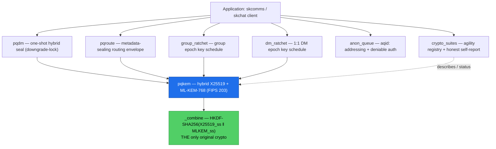
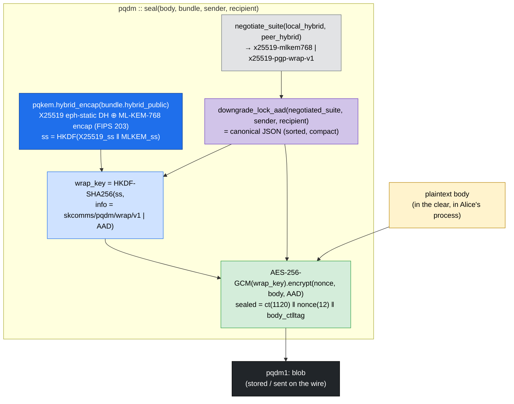
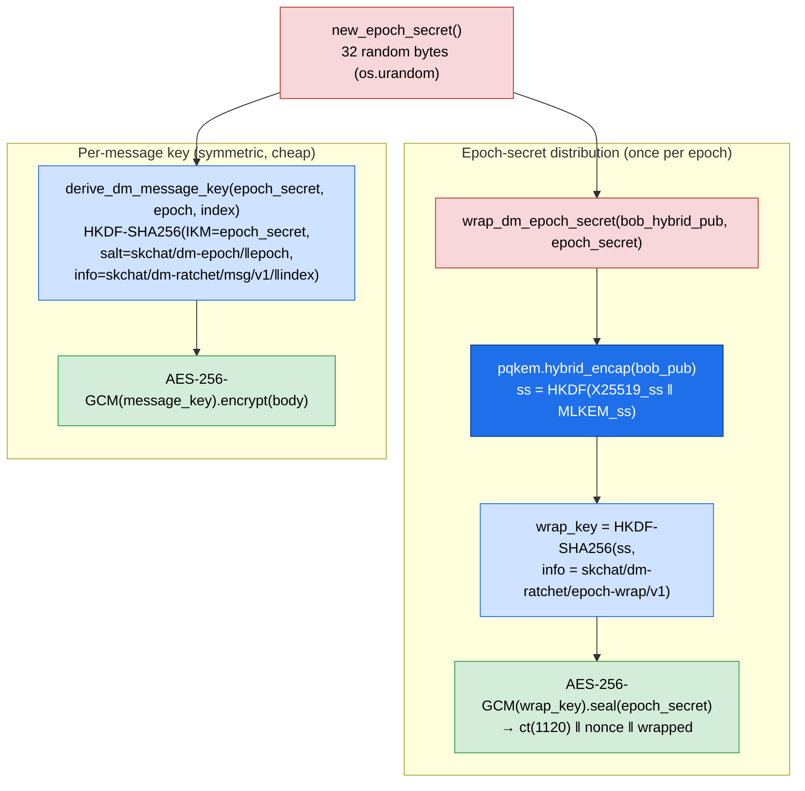
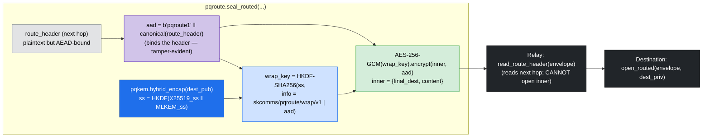
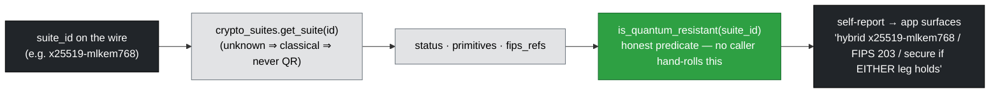

# Architecture — sk-pqc (Python)

This document is the **data-flow** view of `sk-pqc`, per the sk-standards
[DATA_FLOW_STANDARD](https://github.com/smilinTux/sk-standards): it traces concrete
sealing paths **hop by hop**, naming the module, the operation, and the **crypto
posture** (what protects the bytes) at each step. For the static module dependency
graph and the encap/decap sequence see [../SOP.md](../SOP.md) §Architecture; for
per-module summaries see [../README.md](../README.md).

Everything asymmetric/PQ funnels through one module — **`pqkem`** — and one original
construction, the **HKDF-SHA256 hybrid combiner**. Every higher layer is *wiring*
over `pqkem` + AES-256-GCM + HKDF.

---

## Layering

---

## Data-flow 1 — the one-shot seal (`pqdm`) and the downgrade-lock

The marquee path: Alice seals a body to Bob's published hybrid prekey
(`PrekeyBundle`). The **negotiated suite is bound into both** the AEAD AAD **and** the
wrap-key HKDF `info` — so a MITM that strips the hybrid prekey to force a classical
downgrade changes the bytes the sender seals under, and the downgrade cannot be
*silent*. The box style is the **crypto posture** at that hop.

On open, Bob reconstructs the AAD from the suite he believes was negotiated. If a MITM
forced a downgrade, the reconstructed AAD won't match — the AES-256-GCM open fails or
the recorded `negotiated_suite` no longer reads hybrid, surfacing as
**`DowngradeDetected`**. Detection is the self-report.

### Crypto posture per hop

| Hop | Module | Operation | Posture / what protects it |
| --- | --- | --- | --- |
| plaintext | (app) | body in process memory | **none** — cleartext, endpoint-trusted only |
| negotiate | `pqdm` | pick hybrid vs classical from both prekeys | control logic; result is bound into the AAD |
| hybrid encap | `pqkem` | X25519 ⊕ ML-KEM-768, `HKDF(X25519_ss ‖ MLKEM_ss)` | **hybrid PQ** — secure if **either** leg holds (FIPS 203) |
| downgrade-lock AAD | `pqdm` | canonical JSON of `{suite, sender, recipient}` | **AAD bind** — strips become detectable |
| wrap key | `pqdm` | HKDF-SHA256 over KEM secret, `pqdm/wrap` label + AAD | **KDF** — wrap key itself bound to the transcript |
| body seal | `pqdm` | AES-256-GCM(wrap_key) with AAD | **AEAD** — confidentiality + integrity (symmetric, quantum-acceptable) |
| wire | `pqdm` | `pqdm1:` framing | **wire** — coexists with classical PGP in the same field |

**Posture summary.** The KEM ciphertext (the only PQ material) rides once; the body is
sealed under a *symmetric* AES-256-GCM key (already quantum-acceptable). The recorded
blob is HNDL-resistant — secure unless **both** X25519 and ML-KEM-768 break.

---

## Data-flow 2 — the DM epoch ratchet (`dm_ratchet`)

For a stateful 1:1 conversation, the **per-epoch secret** is the only PQ-protected
material — wrapped once through the hybrid KEM and amortised across the epoch, while
each message gets a cheap, index-addressable **symmetric** key.

The `group_ratchet` path is identical in shape with `group-ratchet` HKDF labels
instead of `dm-ratchet` ones — the **distinct domain labels guarantee a DM key can
never collide with a group key** (see [../SOP.md](../SOP.md) §3). Independent
per-epoch secrets give **forward secrecy** across epochs and **post-compromise
security** (a leaked epoch secret doesn't expose past or future epochs).

---

## Data-flow 3 — the routing envelope split (`pqroute1`)

`pqroute` separates what a relay **must** read (the next-hop header — tamper-evident
but visible) from what only the destination may read (the **hybrid-sealed** inner:
final destination + content). The relay learns the next hop *by design*; it cannot
read the inner.

A relay rewriting the header changes the AAD, so the destination's open fails — the
header is **tamper-evident**, the inner is **confidential to the destination only**.

---

## The honesty surface (`crypto_suites`)

Status is resolved **only** from the registry; the self-report only narrates what the
registry says. A classical or unknown suite can **never** be marked
quantum-resistant, and the forbidden marketing words can never reach a caller.

---

## Cross-language note

Every label, length, AAD byte, and canonical-JSON rule shown above is shared verbatim
with the Dart (`sk_pqc`, pub.dev) and Rust (`sk-pqc`, crates.io) implementations. A
blob sealed by any one of the three opens in the other two; the deterministic
constructions are pinned by the shared parity vector
(`tests/vectors/hybrid_kem_x25519_mlkem768.json`) — see [../SOP.md](../SOP.md) §Test.
